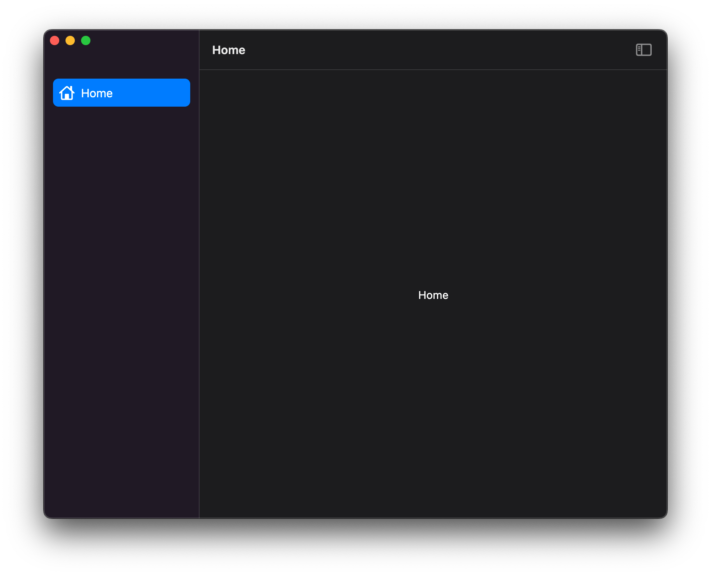

## Overview

Using [`package:mason_cli`](https://pub.dev/packages/mason_cli) you can use the [`macosui_starter`](https://brickhub.dev/bricks/macosui_starter/1.2.1) brick to generate starter applications in seconds. This guide walks you through the process of doing so in detail.

## Getting set up

### Installing `mason_cli`

You can install `mason_cli` by running either one of the following commands in your terminal:

```sh
# 🎯 Activate from https://pub.dev
$ dart pub global activate mason_cli
```

or

```sh
# 🍺 Or install from https://brew.sh
$ brew tap felangel/mason
$ brew install mason
```

### Installing the starter brick

At this point you can install the `macosui_starter` brick. It is recommended that you install it globally so that you can use it in any directory without any additional setup. 

You can do so with the following command:

```sh
# Install globally
$ mason add -g macosui_starter
```

## Configuring your starter app

The `macosui_starter` brick enables you to set up your application in a few different ways. To get started, use your terminal run the following command in the directory of your choice:

```sh
$ mason make macosui_starter
```

You'll be prompted with the following configuration options:

| Name                     | Description                                        | Default Option                                          | Type      |
| ------------------------ | -------------------------------------------------- | ------------------------------------------------------- | --------- |
| `app_name`               | The name of your application                       | `macosui_starter`                                       | `string`  |
| `app_description`        | The description of your application                | `A starter Flutter application for macOS with macos_ui` | `string`  |
| `org_name`               | The name of your organization                      | `com.example `                                          | `string`  |
| `use_translucency`       | Whether to make the application window translucent | `false`                                                 | `boolean` |
| `debug_label_on`         | Whether to show the debug label by default         | `false`                                                 | `boolean` |
| `custom_system_menu_bar` | Whether to add a basic custom system menu bar      | `false`                                                 | `boolean` |
| `add_multi_window`       | Whether to add basic multi-window support          | `false`                                                 | `boolean` |

:::note
If you choose *not* to use window translucency, you'll be prompted for an additional option after you finish configuring the above options:
```sh
$ Hide native window title bar? (y/N)
```
This setting is turned on by default when using window translucency, which why you won't see this prompt if you choose to enable it.
:::

After your application files are generated, `macosui_starter` will automatically run two commands for you: 
* `flutter pub get` - this is run for your convenience, as a time-saver
* `flutter format .` - this is run to make sure your code is properly formatted, since it is difficult to make sure that templated code is properly formatted during development

When your app is generated, you'll see a directory that looks like this:


### Default

If you'd like to configure your app with the absolute basics, simply press the `enter` key for each of the prompts.

When the application is run, it will look like this:


### No Native Titlebar

This configuration removes the native titlebar from the application window. To enable this, you must respond with `n` to the `use_translucency` prompt, and `y` to following prompt:

```sh
$ Hide native window title bar? (y/N)
```

This configuration will generate an application that looks like this:



### Window Translucency

If you'd like to configure your app with [window translucency](https://developer.apple.com/design/human-interface-guidelines/macos/visual-design/translucency/), respond with `y` to the following prompt:

```sh
$ Use window translucency? (y/N)
```

This will generate an application that looks like this:


:::tip
For more information on how the translucency effect is achieved, check out [this Flutter issue](https://github.com/flutter/flutter/issues/59969#issuecomment-916682559).
:::

### Debug Label

By default, apps generated with `macosui_starter` will have Flutter's debug label turned off. If you'd like to have it on to start with, respond with `y` to the following prompt:

```sh
$ Show debug label? (y/N)
```

### Custom System Menu Bar

With the introduction of Flutter 3.0, developers can create custom [system-level menu bars](https://developer.apple.com/design/human-interface-guidelines/macos/menus/menu-bar-menus/). `macosui_starter` takes advantage of this by offering to generate a basic custom menu bar for your application. To take advantage of this, respond with `y` to the following prompt:

```sh
$ Use custom system menu bar? (y/N)
```

The generated application will have a menu bar that looks like this:


For more information on creating and working with custom menu bars, check out the following:
* Flutter Docs:
  * [`PlatformMenuBar`](https://api.flutter.dev/flutter/widgets/PlatformMenuBar-class.html)
  * [`PlatformProvidedMenuItem`](https://api.flutter.dev/flutter/widgets/PlatformProvidedMenuItem-class.html)
* [Deep Dive: Menu Bars](menubar_deepdive)

### Multi-Window

While Flutter has not yet implemented multi-window, a few community packages have done so. `macosui_starter` uses [package:desktop_multi_window](https://pub.dev/packages/desktop_multi_window), which supports all three desktop platforms and has a robust API.

:::note
It is not currently possible to apply the window translucency effect to new Flutter windows. Hopefully this will change in the future.
:::

There are two possible ways to configure a multi-window application with `macosui_starter`:

#### Configuration One: Menu Bar

In this configuration, you can launch a new window by clicking on your applications menu bar and selecting "About", like so:


This will launch a small window that looks like this:


To enable this configuration, respond with `y` to the following prompts:

```sh
$ Use custom system menu bar? (y/N)
$ Add multi-window support? (y/N)
```

#### Configuration Two: "About" tile

In this configuration, you can launch the "About" window via an "About" tile at the bottom of your application's sidebar, like so:


To enable this configuration, respond with `y` to the following prompt:

```sh
$ Add multi-window support? (y/N)
```

For more on multi-window, check out the following:
* Flutter
  * [Support multiple windows for desktop shells](https://github.com/flutter/flutter/issues/30701)
  * [Desktop Multi-Window Support (design doc)](https://docs.google.com/document/d/11_4wntz_9IJTQOo_Qhp7QF4RfpIMTfVygtOTxQ4OGHY/edit)
* [`package:desktop_multi_window`](https://pub.dev/packages/desktop_multi_window)
* [Deep Dive: Multi Window](multiwindow_deepdive)